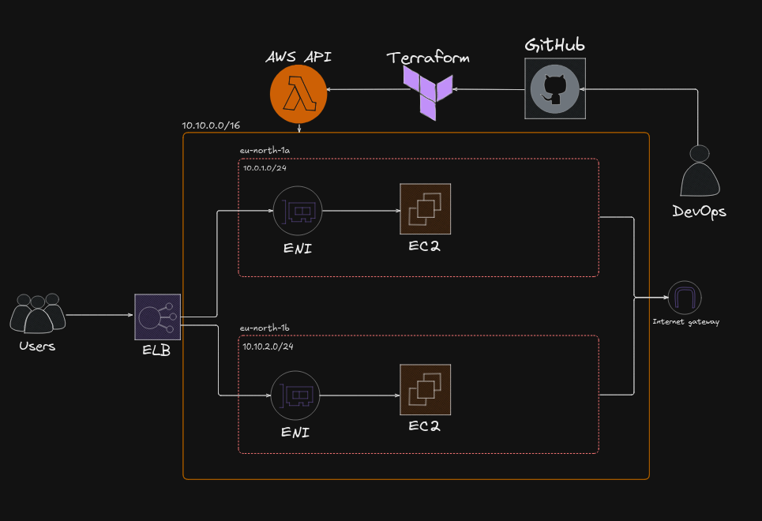

# terraform-aws-github-action 

Deploy AWS infrastructure (EC2, VPC, Security Groups, ELB) using Terraform and GitHub Actions.



---

##  Requirements

- Terraform >= 1.5.0
- AWS CLI configured
- AWS provider version 5.37.0
- **S3 bucket** for remote Terraform state must be created. Write the bucket name in `backend.s3.bucket = "<YOUR_BUCKET_NAME>"` in your Terraform backend configuration.

---

## AWS Configuration

Before running Terraform, configure your AWS credentials:

```bash
aws configure
```

## Usage
```bash
# Initialize Terraform (download providers and modules)
terraform init

# Review the execution plan
terraform plan

# Apply configuration to create resources
terraform apply        # or terraform apply -auto-approve
```
## Use pre-commit for automatically write doc

```bash
# Install pre-commit if not installed
pip3 install pre-commit

# Install git hooks for pre-commit
pre-commit install

# Run pre-commit hooks on all files to generate docs
pre-commit run --all-files
```

## Input Variables
Example terraform.tfvars:
| Name          | Description                     | Type           | Required |
| ------------- | ------------------------------- | -------------- | :------: |
| `vpc_cidr`    | CIDR range for the VPC          | `string`       |    yes   |
| `subnet_cidr` | List of CIDR blocks for subnets | `list(string)` |    yes   |

## GitHub Actions Integration

This project can deploy your infrastructure automatically using GitHub Actions.
When you push changes to the repository, the workflow automatically runs Terraform commands (init, plan, apply) using your configured AWS credentials

Add AWS credentials as GitHub secrets:

1.AWS_ACCESS_KEY → your AWS Access Key ID

2.AWS_SECRET_ACCESS_KEY → your AWS Secret Access Key

## Notes & Tips
Ensure your AWS user has sufficient permissions to create EC2, VPC, SG, and ELB resources.
Always destroy resources when no longer needed to avoid unexpected AWS charges:
```bash
terraform destroy
```